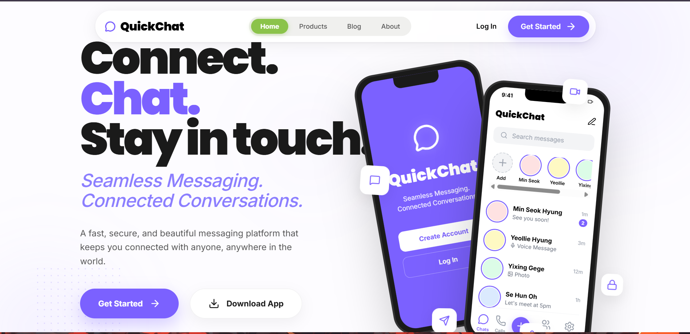

# ☁️ QuickChat | The Future of Secure AI Messaging



QuickChat is a high-performance, privacy-first messaging platform designed for the modern era. Featuring a stunning **Neo-Brutalist** aesthetic and a geometric design system, it combines cutting-edge security with real-time collaboration.

---

## 🚀 Key Features

### 💻 Real-Time Collaborative Coding (New!)
Bring your developer friends into the conversation. QuickChat features an integrated **Real-Time IDE** that allows you to code together while you chat.
*   **Synchronized Editor**: See your friend's cursor and code changes instantly.
*   **Shared Terminal**: Run scripts and debug code in a shared environment.
*   **IDE in a Chat**: Perfect for pair programming, quick bug fixes, or learning to code together without leaving your conversation.

### 🔐 Military-Grade Security
*   **AES-256 Encryption**: Every message is protected by industry-standard end-to-end encryption.
*   **MongoDB-Only Media**: Profile photos and media are stored directly in your database for maximum control and zero external API dependencies.
*   **Privacy First**: Zero-knowledge architecture ensures only you and your recipient can read your messages.

### 🎨 Neo-Brutalist Design
*   **Vibrant Yellow Theme**: High-impact visual language that feels fresh and energetic.
*   **Outfit Typography**: Clean, geometric fonts for maximum readability.
*   **Hard Shadows & Bold Borders**: A premium aesthetic that stands out from generic chat apps.

### ⚡ Performance & Synchronization
*   **Real-Time Sync**: Instant profile updates and message delivery powered by Socket.io.
*   **Smart Link Parsing**: Collaboration invite links and external URLs are automatically detected and formatted.
*   **Responsive Layout**: Flawless experience across Desktop, Tablet, and Mobile.

---

## 🛠️ Tech Stack

*   **Frontend**: React.js, Vite, TailwindCSS, GSAP (Animations), Lucide (Icons)
*   **Backend**: Node.js, Express.js, Socket.io
*   **Database**: MongoDB Atlas
*   **Security**: AES encryption with CBC mode.

---

## 🚦 Getting Started

1.  **Clone the Repository**:
    ```bash
    git clone https://github.com/santhosh2005-santhosh2005/Ai_chatty.git
    ```

2.  **Install Dependencies**:
    ```bash
    # For Backend
    cd fullstack-chat-app/backend && npm install
    # For Frontend
    cd ../frontend && npm install
    ```

3.  **Environment Setup**:
    Create a `.env` file in the `backend` directory:
    ```env
    MONGODB_URI=your_mongodb_connection_string
    JWT_SECRET=your_secret_key
    FRONTEND_URL=http://localhost:5731
    ```

4.  **Run the Project**:
    ```bash
    # Start Backend (Port 5001)
    npm run dev
    # Start Frontend (Port 5731)
    npm run dev
    ```

---

## 📄 License
Distributed under the MIT License. See `LICENSE` for more information.

---

*Built for the 5th Semester Chat Application Project.*
