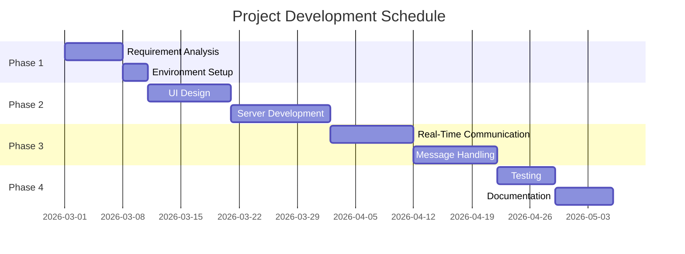

# **P.E.S. COLLEGE OF ENGINEERING, MANDYA**
*(An Autonomous Institution Affiliated to VTU, Belagavi)*

## **DEPARTMENT OF COMPUTER SCIENCE AND BUSINESS SYSTEMS**

---

# **MINI PROJECT SYNOPSIS**

### **PROJECT TITLE:**
## **REAL-TIME CHAT APPLICATION WITH INTEGRATED AI-ASSISTED COLLABORATIVE IDE**

**SUBMITTED BY:**
*   **Harshitha K** (4PS23CB020)
*   **Santhosh D** (4PS23CB040)
*   **Vismay B S** (4PS23CB049)
*   **Namratha G R** (4PS24CB404)

**GUIDED BY:**
*   **Dr. GEETHANJALI T M**
    *Program Head, Dept. of CS & BS*

---

## **1. INTRODUCTION**
Communication systems have evolved significantly with the development of the internet and modern web technologies. Real-time communication applications such as chat platforms have become an essential part of daily digital interaction. These systems allow users to send and receive messages instantly through web or mobile applications.

A real-time chat application enables users to communicate with each other instantly without refreshing the page. This type of application uses technologies that support real-time data transfer between the client and the server. One of the most widely used technologies for this purpose is **Socket.IO**.

Socket.IO is a JavaScript library that enables real-time, bidirectional communication between web clients and servers. It works on top of WebSockets and provides features such as event-based communication, automatic reconnection, and low-latency message transmission.

In this project, a real-time chat application will be developed using Node.js for the server-side environment and Socket.IO for real-time communication. The system will allow multiple users to join a chat interface and exchange messages instantly.

The application will include advanced collaboration features such as **real-time code synchronization**, multi-user cursors, and an **AI-powered coding assistant**. This project demonstrates the practical implementation of high-frequency data synchronization and provides hands-on experience in full-stack engineering for professional collaboration tools.

The system helps students understand modern web communication techniques and how real-time applications such as messaging platforms are built.

## **2. OBJECTIVES**
The main objectives of the project are:
*   To develop a real-time web-based chat application.
*   To implement a **Collaborative IDE** for synchronized code editing.
*   To integrate an **AI Coding Assistant** for real-time debugging and refactoring.
*   To use Socket.IO for real-time bidirectional communication of code operational logs.
*   To create a seamless interface for simultaneous text and technical collaboration.
*   To demonstrate the use of Node.js for backend development.
*   To understand event-driven programming in web applications.

## **3. FEASIBILITY STUDY**
A feasibility study is performed to determine whether the proposed system can be developed successfully within the available resources and time.

### **3.1 Technical Feasibility**
The project is technically feasible because it uses widely available technologies such as Node.js, Socket.IO, HTML, CSS, and JavaScript. These tools are open-source and well documented, making the development process easier.

### **3.2 Economic Feasibility**
The system is cost-effective because it uses free and open-source technologies. No additional hardware or paid software is required.

### **3.3 Operational Feasibility**
The application is simple and easy to use. Users only need a web browser and internet connection to access the chat interface.

### **3.4 Time Feasibility**
The project can be completed within the academic timeline since the technologies involved are lightweight and easy to implement.

## **4. METHODOLOGY / PLANNING OF WORK**
The development of the chat application follows several stages:

1.  **Requirement Analysis**: Understanding the system requirements and defining the basic functionalities such as sending messages, receiving messages, and user connection handling.
2.  **Environment Setup**: Installing necessary tools such as Node.js, npm, and required libraries including Socket.IO.
3.  **User Interface Design**: Designing a simple chat interface using HTML and CSS where users can type and view messages.
4.  **Server Development**: Developing the backend server using Node.js to manage client connections and message broadcasting.
5.  **Real-Time Communication**: Implementing Socket.IO to establish real-time communication between the client and server.
6.  **Message Handling**: Developing functionality to send messages from one user and broadcast them to all connected users.
7.  **Testing**: Testing the application with multiple users to ensure messages are delivered instantly.
8.  **Deployment and Documentation**: Finalizing the project, documenting the implementation, and preparing the project report.

## **5. SOFTWARE / HARDWARE REQUIREMENTS**

### **5.1 Hardware Requirements**
*   **System**: Computer or Laptop
*   **RAM**: Minimum 4 GB RAM
*   **Processor**: Intel i3 or higher
*   **Connectivity**: Internet connection

### **5.2 Software Requirements**
*   **Operating System**: Windows / Linux
*   **Backend Technology**: Node.js
*   **Real-time Communication**: Socket.IO
*   **Frontend Technologies**: HTML, CSS, JavaScript
*   **Code Editor**: VS Code

## **6. BENEFITS OF THE PROJECT FOR THE SOCIETY**
The real-time chat application demonstrates how instant communication combined with collaborative technical tools can be developed using modern web technologies.

### **6.1 Key Collaboration Features**
*   **Synchronized Code Editor**: Integration of the Monaco Editor (the engine behind VS Code) allowing multiple users to edit the same file simultaneously.
*   **Operational Transformation (OT) / Sync**: Using Socket.IO to broadcast text changes, cursor positions, and selections in real-time with millisecond latency.
*   **AI-Powered Pair Programming**: A dedicated AI assistant within the collaboration session that can analyze the shared code, suggest fixes, and generate code snippets.
*   **Virtual File System**: Allows users to manage files and folders within a collaborative session, with all changes reflected instantly for every participant.
*   **Terminal Sandbox**: A secure environment to execute code snippets directly within the application to verify logic during chat discussions.

This project can be extended for various applications such as:
*   Online customer support systems
*   Team collaboration platforms
*   Social networking applications
*   Educational communication platforms
*   Live discussion forums

The project also helps students understand real-time communication technologies, event-driven programming, and full-stack web development.

## **7. SCHEDULE OF PROJECT WORK COMPLETION**

**Figure 1: Gantt Chart Showing the Schedule of Project Work for the Real-Time Chat Application using Socket.IO**

## **8. REFERENCES**
1.  Socket.IO Official Documentation – [https://socket.io](https://socket.io)
2.  Node.js Official Documentation – [https://nodejs.org](https://nodejs.org)
3.  MDN Web Docs – WebSocket and Real-time Communication
4.  Tutorials and articles on real-time web applications
5.  Research papers related to web-based communication systems
